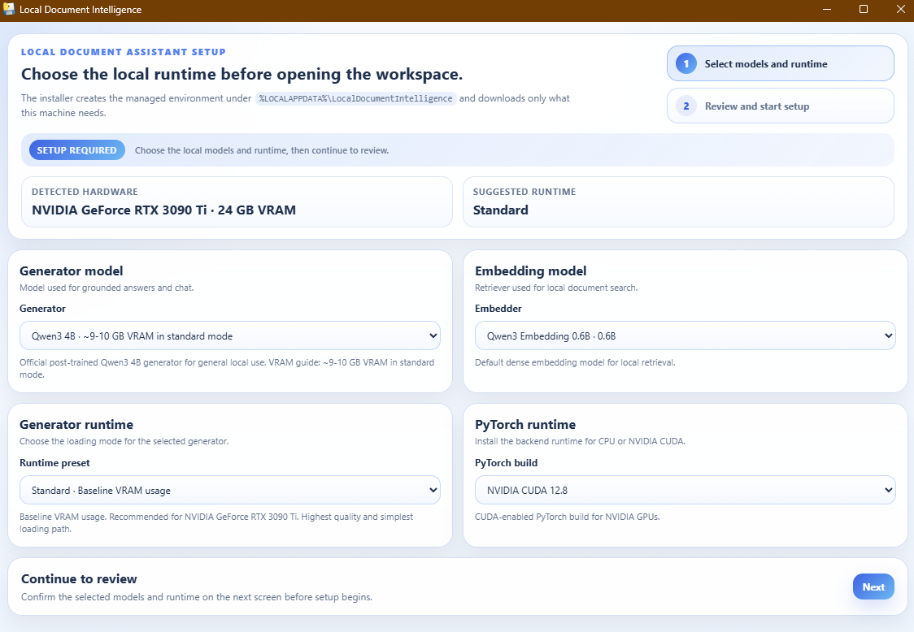
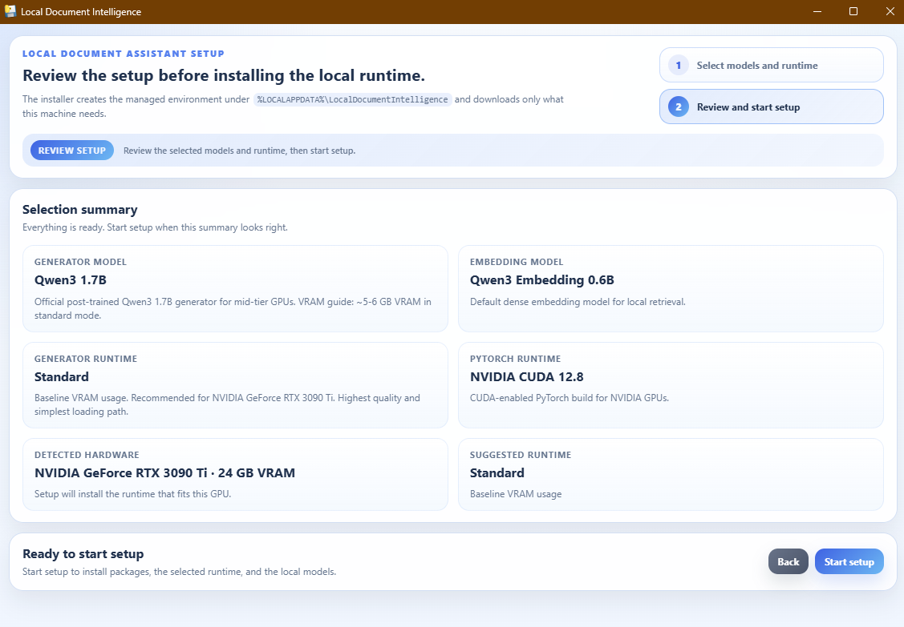
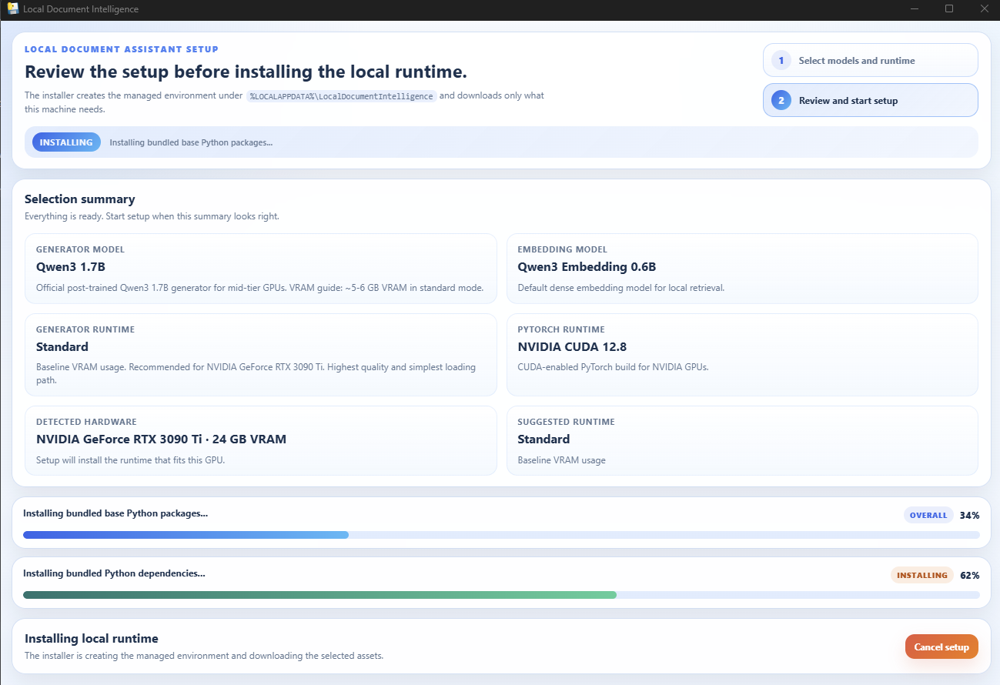
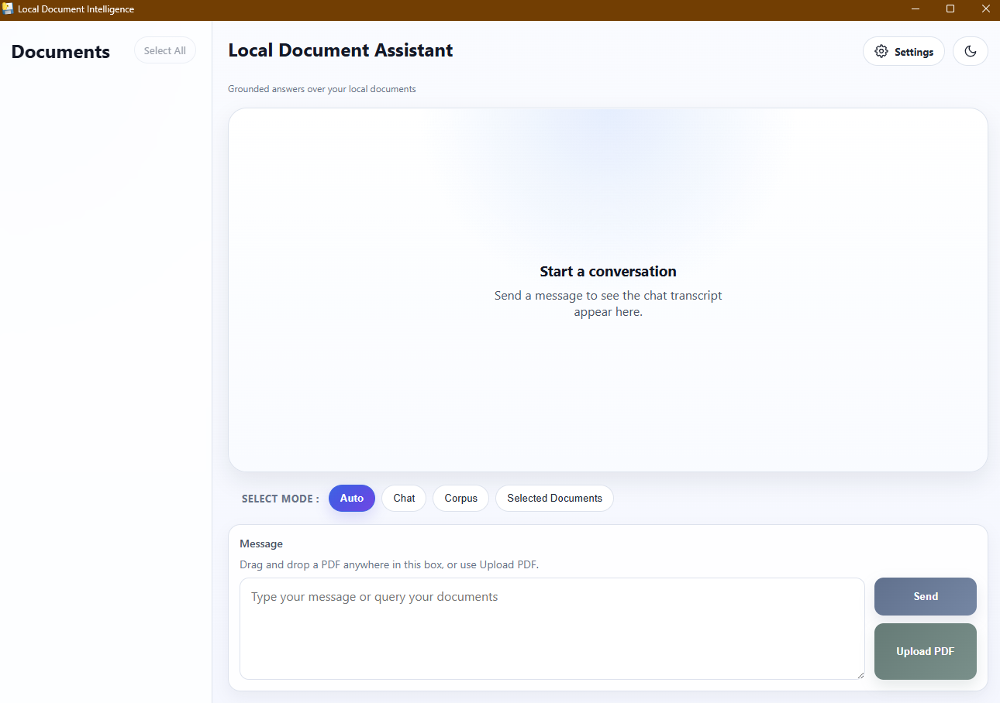

# 🚀 Installation

This guide is for the packaged Windows release of **Local Document Intelligence**.

## 1. Download and open the Windows EXE

Download the latest packaged release and start the application.

The setup window will open first and guide you through the local runtime installation.

---

## 2. Select the model and runtime preset

Choose the generator model and runtime preset that best fit your machine.

- Pick a smaller model for lower-memory systems
- Pick a larger model for a better overall experience on higher-VRAM machines
- Keep the suggested runtime unless you have a reason to change it

  

After confirming your choices, click **Next**.

---

## 3. Review the setup and start installation

Check the selected model, embedding model, runtime, and detected hardware.

If everything looks correct, click **Start setup**.

The application will store its models and runtime files locally on your machine.

  

---

## 4. Wait for installation to complete

The installer will prepare the local environment, install dependencies, and download the required local models.

First-time setup may take longer because the required assets need to be downloaded and installed.

  

Keep the window open until setup finishes.

---

## 5. Start using the application

Once installation is complete, the main application will open and your local workspace will be ready.

You can then upload PDFs and start querying your documents.

  

